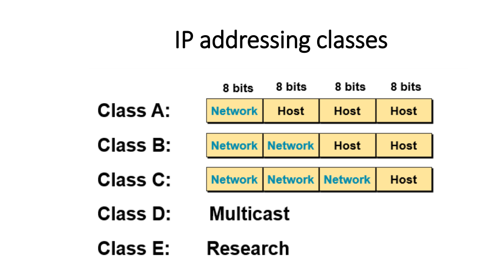
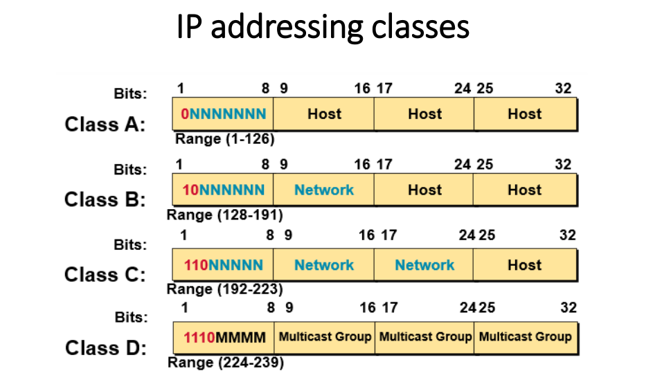
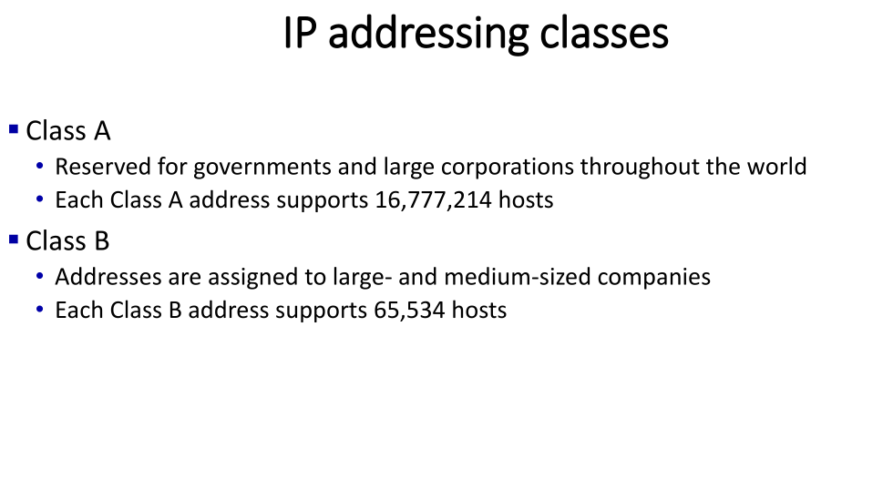
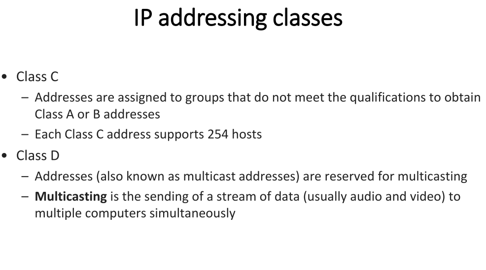
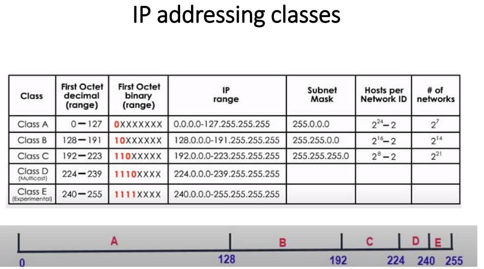

# IP address v4 32 Bit divided by 4 groups 8 bit for each
# IP V6 128 bit divided by 8 groups 16 bit for each

## MAC address in another hand is for small network like company or house 
## so all the devices can interact to each other with this MAC address

